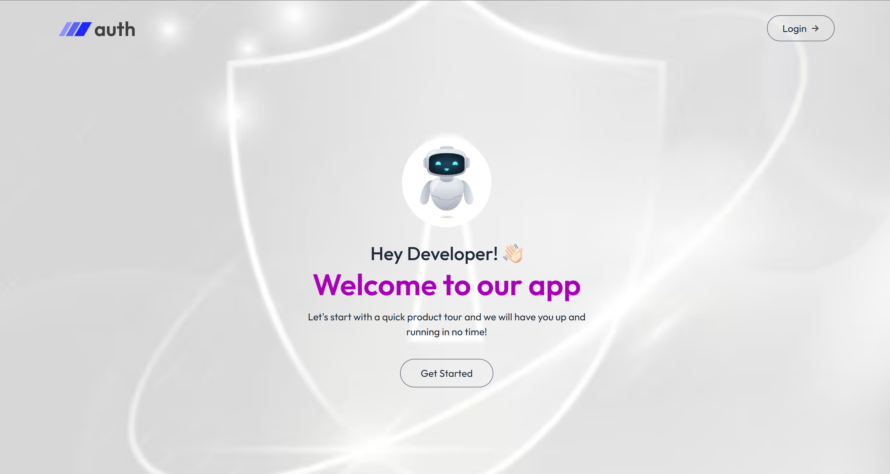
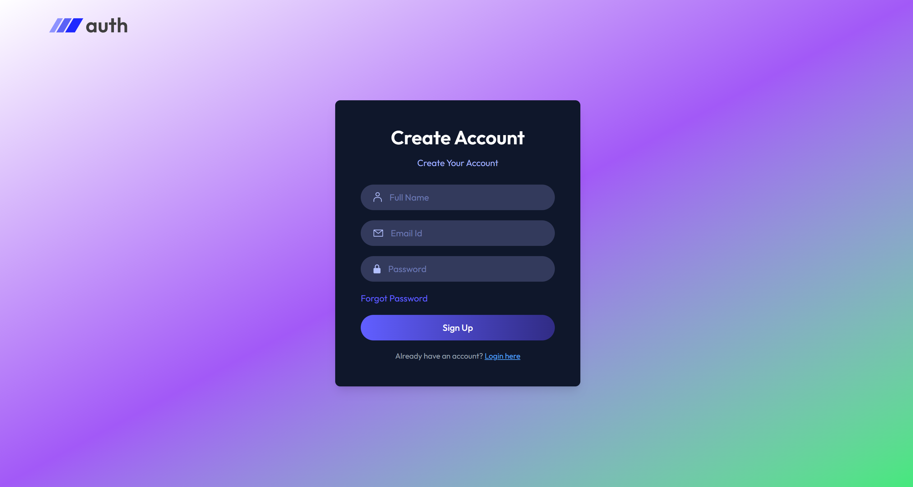
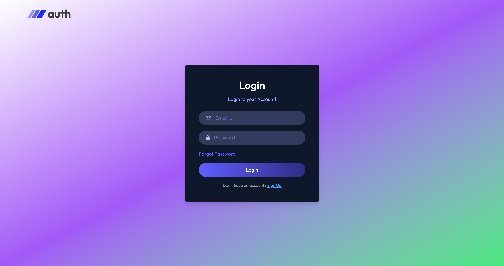

# 🔐 MERN Authentication App

A modern, full-stack authentication system built with the MERN stack (MongoDB, Express, React, Node.js). Features secure user registration, login, JWT authentication, email verification, password reset, and a beautiful UI powered by Tailwind CSS.

## 🌐 Live Demo

- **Frontend**: <a href="https://mern-auth-frontend-ffah.onrender.com" target="_blank" rel="noopener noreferrer">https://mern-auth-frontend-ffah.onrender.com</a>
- **Backend API**: <a href="https://mern-auth-backend-ffah.onrender.com" target="_blank" rel="noopener noreferrer">https://mern-auth-backend-ffah.onrender.com</a>

---

## 🚀 Features

- ✅ User Registration & Login
- 🔒 JWT-based Authentication
- 🧠 Context API for Global State
- 🔄 Persistent Login with Token Storage
- 📧 Email Verification & Password Reset via Nodemailer
- ⚙️ Robust Backend Validation & Error Handling
- 🎯 Protected Routes (Frontend & Backend)
- 📦 RESTful API with Modular Controllers
- 🎨 Responsive UI (Tailwind CSS)

---

## 🧱 Tech Stack

| Frontend      | Backend   | Database | Auth | Mail        |
|---------------|-----------|----------|------|-------------|
| React         | Node.js   | MongoDB  | JWT  | Nodemailer  |
| Context API   | Express   | Mongoose | bcrypt | SMTP      |
| Tailwind CSS  |           |          |      |             |

---

## 📁 Folder Structure

### 🖥️ Client

```
client/
├── assets/         # Static assets (images, icons)
├── components/     # Reusable UI components
│   ├── Header.jsx
│   ├── Navbar.jsx
├── context/        # AppContext for auth state
│   └── AppContext.jsx
├── pages/          # Route-based pages
│   ├── Home.jsx
│   ├── Login.jsx
│   ├── ResetPassword.jsx
│   ├── EmailVerify.jsx
├── App.jsx
├── main.jsx
├── index.css
```

### ⚙️ Server

```
server/
├── public/               # Static files
├── src/
│   ├── controller/       # Auth & User controllers
│   │   ├── auth.controller.js
│   │   └── user.controller.js
│   ├── db/               # MongoDB connection
│   │   └── connectDB.js
│   ├── middlewares/      # Auth middleware
│   │   └── auth.middleware.js
│   ├── models/           # Mongoose schemas
│   │   └── auth.model.js
│   ├── nodemailer/       # Email config
│   │   ├── mailOptions.js
│   │   └── nodemailer.js
│   ├── routes/           # API routes
│   │   ├── auth.route.js
│   │   └── user.route.js
│   └── utils/            # Utility files
│       ├── apiError.js
│       ├── apiResponse.js
│       └── emailTemplate.js
│   ├── app.js            # Express app setup
│   └── index.js          # App entry point
├── .env
├── package.json
```

---

## 🛠 Setup Instructions

### 1. Clone the Repo

```bash
git clone https://github.com/rj9884/mern-auth.git
cd mern-auth
```

### 2. Install Dependencies

```bash
# Backend
cd server
npm install

# Frontend
cd ../client
npm install
```

### 3. Configure Environment Variables

Create a `.env` file in the `server` folder:

```
PORT=5000
MONGODP_URI=your_mongodb_connection_string
ACCESS_TOKEN_SECRET=your_jwt_secret
ACCESS_TOKEN_EXPIRY=7d
SMTP_USER=your_email@example.com
SMTP_PASS=your_email_password
SENDER_EMAIL=your_email@example.com
CORS_ORIGIN=http://localhost:5173
```

### 4. Run the App

```bash
# Start Backend
cd server
npm start

# Start Frontend
cd ../client
npm run dev
```

---

## 🔐 Authentication Flow

1. **User registers** → hashed password stored in MongoDB
2. **User logs in** → JWT token issued and stored in cookies
3. **Protected routes** → token checked via middleware
4. **Email verification** → OTP sent via Nodemailer
5. **Password reset** → OTP sent, user resets password
6. **Context API** manages global auth state

---

## 📸 Screenshots

> 
> 
> 
> 

---

## 🧠 Developer Notes

- Uses **Axios** for clean API calls
- Handles edge cases like token expiry and missing fields
- Context propagation ensures user data is available across components
- UI optimized with conditional rendering and spinners
- Nodemailer integration for email verification and password reset

---

## 🤝 Contributing

Pull requests are welcome! For major changes, please open an issue first to discuss what you’d like to change.

---

## 📄 License

This project is licensed under the MIT License.

---

## 💬 Contact

📧 Email: rj.vidyagyan@gmail.com
Feel free to reach out for feedback
